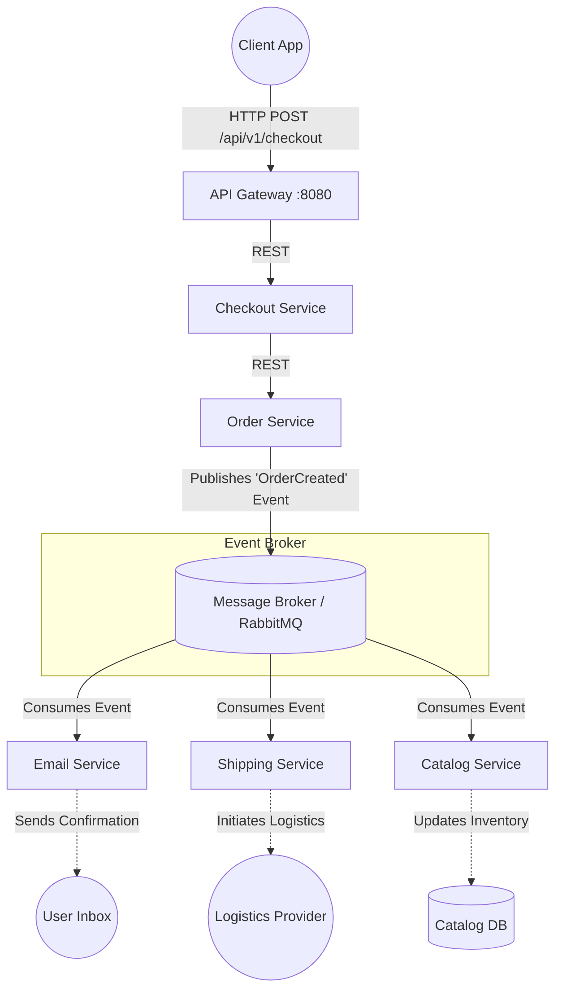

# Perfume E-Commerce Platform - Microservices Architecture

An enterprise-level E-commerce platform built with a modern Microservices Architecture, API Gateway pattern, and Event-Driven Architecture (EDA) principles (Node.js, Express, PostgreSQL, Docker).

---

## 🏗️ Architecture Overview

The system is composed of several independent, single-responsibility microservices. Each service has its own dedicated PostgreSQL database to ensure loose coupling and bounded contexts.

*   **API Gateway** (`:8080`): Central entry point for all client requests. Handles proxying, rate-limiting, and security.
*   **Catalog Service** (`:7006`): Manages perfume products, categories, and inventory.
*   **Cart Service** (`:7001`): Manages user shopping carts.
*   **Checkout Service** (`:7004`): Orchestrates the checkout process, calculates totals, and initiates orders.
*   **Order Service** (`:5003`): Manages order lifecycles and statuses.
*   **Payment Service** (`:7003`): Mock service for handling payment transactions.
*   **Shipping Service** (`:7008`): Manages logistics and delivery tracking.
*   **Email Service** (`:7005`): Handles asynchronous notifications to users.
*   **Recommendation Service** (`:7007`): Provides AI/Rule-based product recommendations.
*   **Ad Service** (`:7002`): Manages promotional banners and advertisements.
*   **Currency Service** (`:7009`): Handles multi-currency pricing conversions.

### 📊 Internal Queue Structure (Event-Driven Architecture)

To ensure high availability and prevent cascading failures, the system uses an **Event-Driven Architecture**, primarily utilizing a message broker (e.g., RabbitMQ/Kafka) for asynchronous communication, explicitly after a checkout occurs.



*   **Producer**: The `Order Service` (or `Checkout Service`) acts as the producer, publishing an event (`OrderCreated`) once payment is successful.
*   **Consumers**: 
    - `Email Service`: Sends an order confirmation email to the user.
    - `Shipping Service`: Creates a shipping manifest and tracking ID.
    - `Catalog Service`: Deducts the purchased quantities from available inventory.

---

## 📂 Project File Structure

```text
c:\Data_Nagendra\perfume_website\
│
├── api-gateway/            # Express-based reverse proxy middleware
│   ├── src/server.js       # Target definitions and rate-limiters
│   └── Dockerfile
├── cart-service/           # Shopping Cart Microservice
├── catalog-service/        # Product Catalog Microservice
├── checkout-service/       # Checkout orchestration
│   └── src/services/checkoutService.js # Checkout logic & EDA publisher implementation
├── order-service/          # Order lifecycle management
├── payment-service/        # Mock payment gateway
├── shipping-service/       # Delivery management
├── email-service/          # Notification microservice
├── recommendation-service/ # Product suggestions
├── ad-service/             # Advertising & Banners
├── currency-service/       # Currency conversion
│
├── frontend/               # Vanilla HTML/JS frontend application
│   ├── index.html          # Main storefront UI
│   ├── admin-portal.html   # Dashboard for inventory and order management
│   └── package.json
│
├── init-db.sql             # Global PostgreSQL Initialization script
└── docker-compose.yml      # Container orchestration file
```

---

## 🚀 How the Project Works (Flow)

1.  **Browsing**: The user hits `index.html`. The frontend calls `/api/v1/catalog` (via API Gateway) to load perfumes.
2.  **Cart**: Adding to cart sends a `POST /api/v1/cart`.
3.  **Checkout**: The user clicks "Proceed to Secure Checkout". A request goes to `/api/v1/checkout/`.
4.  **Order Generation**: The Checkout service validates items, applies shipping logic, and forwards the authorized intent to the `Order Service`.
5.  **Asynchronous Fulfillment**: The Order service saves the order to its DB and (via the Message Queue) asynchronously notifies the Email and Shipping services so the user doesn't wait for these processes to complete during the HTTP request lifecycle.

---

## 🛠️ Full Project APIs & Postman Testing Payloads

Import these payloads into **Postman** to test the system endpoints. **Note**: Always hit the `API Gateway` on port `8080`.

### 1. Catalog Service (`/api/v1/catalog`)
**GET All Products**
*   **Method**: `GET`
*   **URL**: `http://localhost:8080/api/v1/catalog/`

---

### 2. Checkout Service (`/api/v1/checkout`)
**Initiate a Checkout**
*   **Method**: `POST`
*   **URL**: `http://localhost:8080/api/v1/checkout/`
*   **Headers**: `Content-Type: application/json`
*   **Body** (Raw JSON):
```json
{
  "user_id": 101,
  "items": [
    {
      "product_id": 1,
      "price": 8500,
      "quantity": 1
    },
    {
      "product_id": 3,
      "price": 4500,
      "quantity": 2
    }
  ],
  "shipping_address": "123 Fragrance Lane, Paris, France"
}
```

---

### 3. Order Service (`/api/v1/orders`)
**Get All Orders (Admin)**
*   **Method**: `GET`
*   **URL**: `http://localhost:8080/api/v1/orders/`

**Update Order Status**
*   **Method**: `PUT`
*   **URL**: `http://localhost:8080/api/v1/orders/1/status`
*   **Body** (Raw JSON):
```json
{
  "status": "SHIPPED",
  "tracking_number": "TRK-987654321-FR"
}
```

---

### 4. Email Service (`/api/v1/emails`)
*(Usually triggered internally via Queue, but can be tested via API if exposed)*
*   **Method**: `POST`
*   **URL**: `http://localhost:8080/api/v1/emails/`
*   **Body** (Raw JSON):
```json
{
  "to": "customer@example.com",
  "subject": "Order Confirmation #101",
  "body": "Thank you for shopping at our Perfume Store! Your order is being processed."
}
```

---

## 🌩️ Production Deployment Strategies

Deploying a microservices architecture to production requires robust orchestration, monitoring, and CI/CD pipelines. Below are the recommended strategies for deploying this platform at scale:

### 1. Container Orchestration (Kubernetes / AWS EKS)
For a production-grade deployment, raw `docker-compose` is insufficient. Container orchestration is required to manage failover, auto-scaling, and rolling updates.
*   **Kubernetes (K8s)**: Define Deployments, Services, and ConfigMaps for each of the 10 microservices. Use **Horizontal Pod Autoscalers (HPA)** based on CPU/Memory utilization.
*   **Ingress Controller**: Replace the raw API Gateway port binding with an NGINX Ingress Controller or AWS Application Load Balancer (ALB) to handle SSL termination and route traffic to the `api-gateway` service.

### 2. CI/CD Pipeline Integration
Implement a fully automated Continuous Integration and Continuous Deployment pipeline (using GitHub Actions, GitLab CI, or Jenkins).
*   **CI Stage**: Run linting (`ESLint`), unit tests, and sonarqube scans on Push/PRs.
*   **Docker Build**: Build and push Docker images to a private container registry (e.g., AWS ECR, Docker Hub) with Semantic Versioning tags.
*   **CD Stage**: Trigger ArgoCD or run `kubectl apply` to deploy the new image tags seamlessly without downtime.

### 3. Managed Database (AWS RDS / GCP Cloud SQL)
Instead of running a PostgreSQL instance inside a container (`perfume_postgres`), production systems must use managed database services.
*   **High Availability**: Provision Multi-AZ RDS deployments for automatic failovers.
*   **Read Replicas**: Direct read-only traffic (like the Catalog Service) to read replicas, and write-traffic (Order, Cart) to the primary instance.
*   **Automated Backups**: Configure point-in-time recovery and snapshot backups.

### 4. Managed Message Broker (RabbitMQ / Amazon SQS)
The Event-Driven Architecture relies heavily on the message broker. 
*   **Amazon MQ or CloudAMQP**: Use fully managed, multi-node RabbitMQ clusters to prevent the messaging queue from becoming a single point of failure.
*   **Dead Letter Queues (DLQ)**: Ensure failed events (e.g., Email Service failing to send) are routed to a DLQ for alerts and manual reprocessing.

### 5. Observability (Logging & Monitoring)
Microservices are inherently complex to debug. Centralized logging and tracing are mandatory.
*   **Logging**: Use the **ELK Stack** (Elasticsearch, Logstash, Kibana) or **Datadog**. Have every container output structured JSON logs to stdout.
*   **Prometheus & Grafana**: Export `/metrics` endpoints from Node.js and monitor memory, event throughput, and active connections visually.
*   **Distributed Tracing**: Implement **OpenTelemetry / Jaeger** passing `X-Trace-Id` across all HTTP and AMQP calls to track requests hopping from the Gateway -> Checkout -> Order -> Email.

### 6. Security Hardening
*   **Secrets Management**: Never inject raw passwords via ENV vars. Use AWS Secrets Manager or HashiCorp Vault to inject credentials securely into the containers at runtime.
*   **WAF**: Deploy AWS WAF (Web Application Firewall) ahead of the Ingress to prevent DDoS, SQL injection, and rate-limit malformed requests.
*   **Network Policies**: Configure Kubernetes Network Policies to restrict traffic. For instance, the `db` should only accept internal cluster traffic from specified services.

---

### Local/Staging Testing Environment
For staging and local development, you can still use Docker Compose:
```bash
# Start the system locally
docker-compose up -d --build

# Verify Gateway Health
curl http://localhost:8080/health

# Tear down and clean volumes
docker-compose down -v
```
